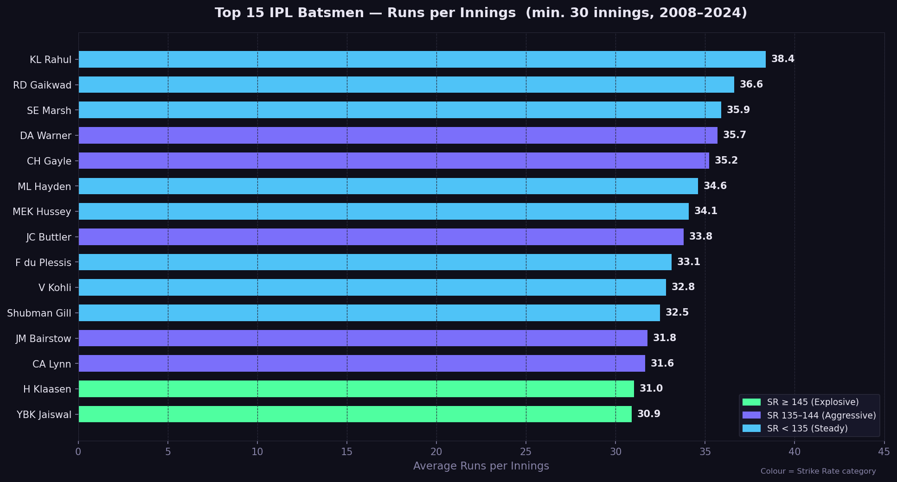
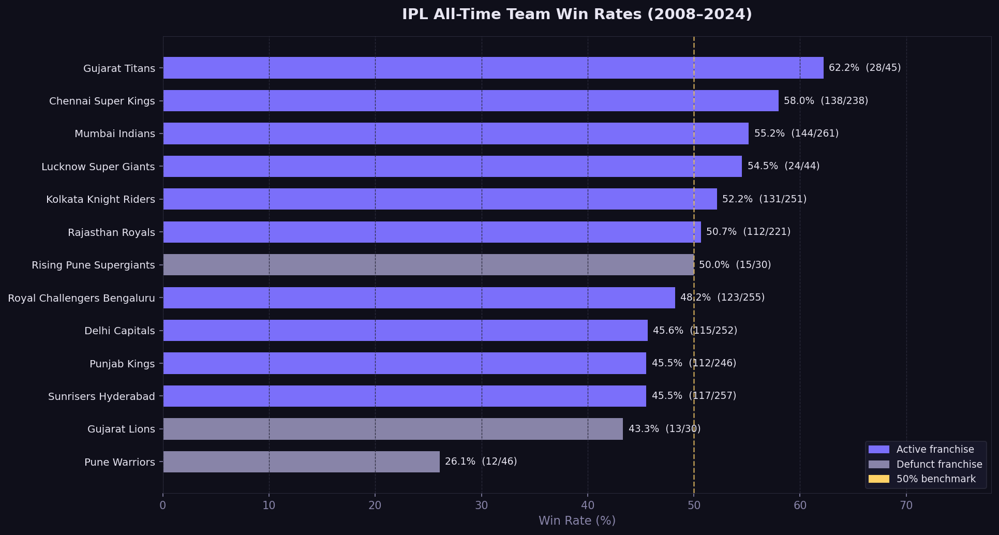
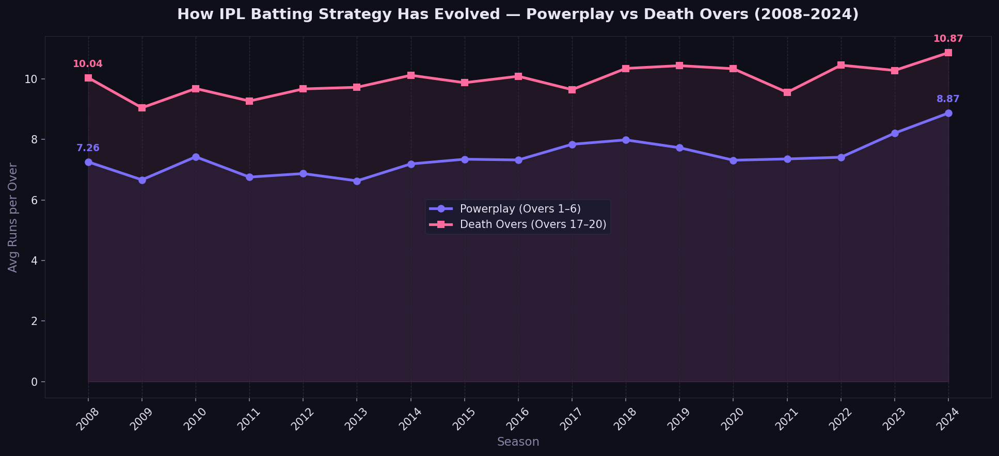
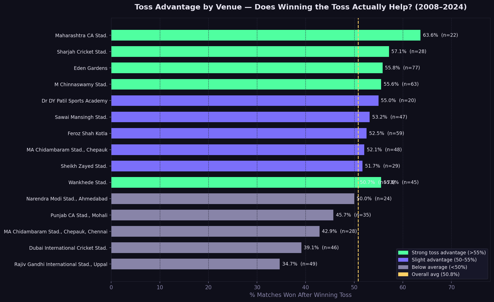
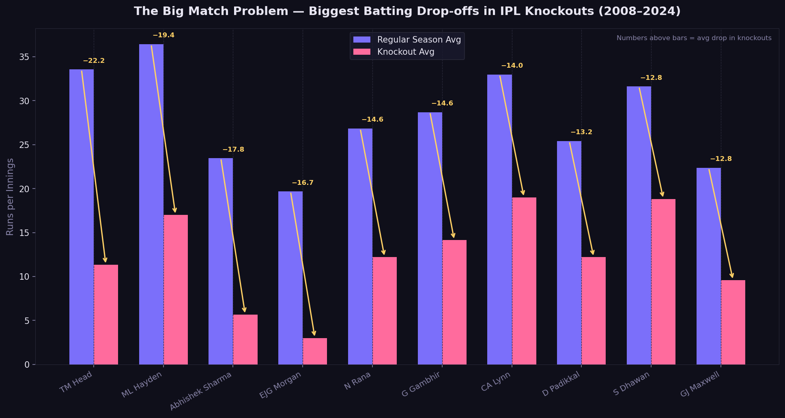

# 🏏 IPL Player Value & Team Performance Analytics

> Python · pandas · matplotlib · seaborn · Power BI  
> 17 seasons of IPL data (2008–2024) | 1,095 matches | 250,000+ ball-by-ball deliveries

---

## Dashboard Preview



📊 **[View Dashboard Report(PDF)](IPL_Analytics_Dashboard_Siddharth.pdf)**

---

## Business Questions Answered

| # | Question | Approach |
|---|----------|----------|
| 1 | Which batsmen give the best value per innings? | Runs/innings + strike rate across 30+ innings |
| 2 | Which teams have been most consistently successful? | All-time win rate across 1,095 matches |
| 3 | How has IPL batting strategy evolved? | Powerplay vs Death over run rates by season |
| 4 | Does winning the toss actually win you the match? | Toss-to-win conversion rate by venue |
| 5 | Who are the biggest knockout underperformers? | Regular season avg vs knockout avg drop-off |

---

## Key Insights

- **KL Rahul** leads all IPL batsmen with **38.4 runs per innings** across 122 innings —
  the most consistent top-order performer in tournament history
- **Gujarat Titans** achieved the highest all-time win rate (**62.2%**) despite being one
  of the newest franchises — modern squad analytics beats star power
- Powerplay scoring jumped **22% in 17 years** (7.26 → 8.87 runs/over), reflecting a
  fundamental shift toward aggressive batting
- Toss advantage is **barely better than a coin flip overall (50.8%)** but venue-specific
  conversion at Maharashtra CA Stadium reaches **63.6%**
- Several high-average batsmen show dramatic performance drops in knockout matches —
  regular season stats alone are a poor predictor of big-match value

---

## Charts

| Q1 — Batsman Value | Q2 — Team Win Rates |
|---|---|
|  |  |

| Q3 — Strategy Evolution | Q4 — Toss Advantage |
|---|---|
|  |  |

| Q5 — Knockout Underperformers |
|---|
|  |

---

## Tech Stack

- **Python** — pandas, matplotlib, seaborn, numpy
- **Power BI Desktop** — 3-page interactive dashboard
- **Data Source** — [IPL Complete Dataset on Kaggle](https://www.kaggle.com/datasets/patrickb1912/ipl-complete-dataset-20082020)

---

## How to Run

```bash
# 1. Clone the repo
git clone https://github.com/sidrm22/ipl-player-analytics

# 2. Install dependencies
pip install pandas matplotlib seaborn numpy

# 3. Download matches.csv and deliveries.csv from Kaggle link above
#    and place them in the project root folder

# 4. Run notebooks in order (01 through 05) in Jupyter
# 5. Run visualisations
python 06_visualisations.py
```

---

*Project by Siddharth Rajesh Menon — [LinkedIn](https://www.linkedin.com/in/siddharth-rajesh-menon)*
